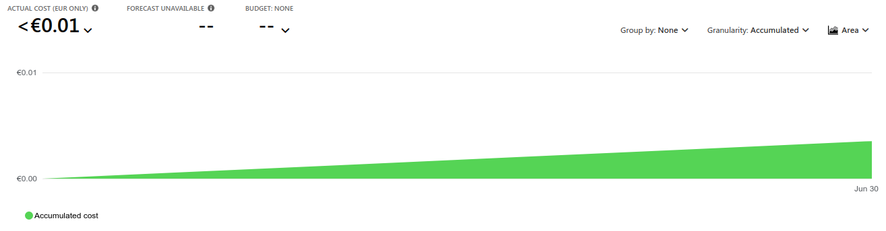

  <h1>IeCAG</h1>
  

## Description
A small simulated cryptocurrency trading platform.

## Live-Demo

## Visuals

## Usage

## Support
[Yell at us](https://inf-git.fh-rosenheim.de/int-ca/sose2024/iecag/-/issues)

## Features
- User creation & managment
  - collection and managing of user information
  - including name, associated wallets, transactions
  - **Acceptance criteria**:
    - user must be able to create an account with a chosen name
    - user must be able to login with his credentials
    - user must be able to view his wallets and value

- Crypto Wallet simulation
  - contents and value are simulated
  - **Acceptance criteria**:
    - user must be able to create wallets

- Faux Trading
  - backend runs a simulation based on real-world prices.
  - users can buy and sell cryptocurrencies with fiat currency
  - **Acceptance criteria**:
    - user must able to trade with his wallets, (sell and buy cryptocurrencies)
    - simulation must check the impact on price and the wallet value

- Price History
  - historical data of cryptocurrencies are cached
  - **Acceptance criteria**:
    - retention policy of price data for 180 days (even if the project isn't this old)
    - user must be able to view a price history chart over at least the last 30 days (if data is available)

- Notifications to user
  - IFTTT (**I**f **T**his **T**hen **T**hat) interface for users to be notified about e.g. prices passing a threshold
  - **Acceptance criteria**:
    - user must be able to create rules like: if "$cryptocurrency" "$price" "is_lower_than" "1337"

## Pipeline Summary
Default for all azure-cli jobs:
- Log into Azure using a service principal.

Fire drill (*tilly_nuke*):
- Deletes the resource group if NUKE is set to true.

Azure Setup using the chonk method (*azure_create_resource_group_datatable_appserviceplan_webapp*):
- Creates the resource group and storage account.
- Creates storage tables.
- Sets up Application Insights.
- Creates App Service plans and web apps, setting necessary configurations.

Build Web App (*azure_build_webapp*):
- Builds the .NET web app and packages it into a zip file.

Build Wrapper (*azure_build_wrapper*):
- Sets up a Python virtual environment, installs dependencies, and packages the API wrapper into a zip file.

Deploy Web Apps (*azure_deploy_webapp*):
- Deploys the web app and the API wrapper using the zip packages created earlier.

## Costs

## Roadmap
- [x] 2024-04-09: Teams and topic defined: A project with the team members was created on GitLab
- [x] 2024-05-07: Project description, use cases, features are defined and described and checked in on GitLab
- [x] 2024-06-04: Interim project status
- [ ] 2024-07-09: Final presentation

## Division of Duties
| Ruf, Lukas              | Tahiri, Arlind             | Gigl, Soph            |
| ------                  | ------                     | ------                |
|    CI Pipeline          |    Backend development     |  Heartbeat            |
|    API Wrapper          |    Frontendent development |  Notifications/Alerts |
|    Infrastructure Setup |                            |                       |

## Authors and acknowledgment
- [Arlind Tahiri](https://inf-git.fh-rosenheim.de/studtahiar5766)
- [Lukas Ruf](https://inf-git.fh-rosenheim.de/studrufzlu7742)
- [Sophie Gigl](https://inf-git.fh-rosenheim.de/studgiglso3560)

## Project status
Active

